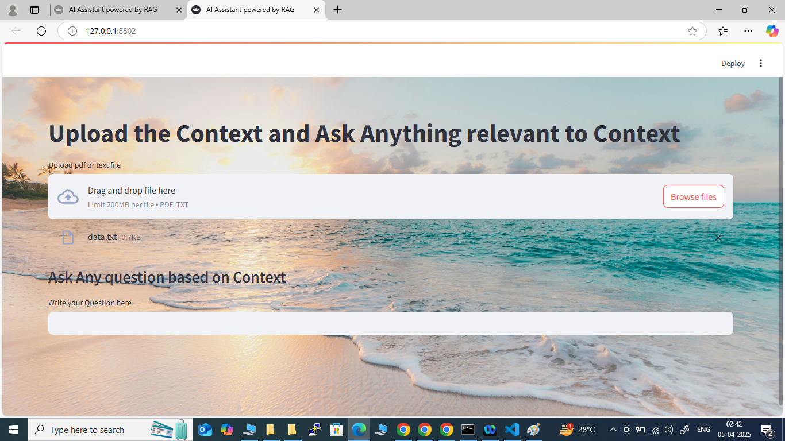

# 🚀 AI-Powered RAG Pipeline

## 📸 Demo


## 📸 UI Exposure



## 📸 RAG Response on User Query


## ⚙️ Features

- 🔍 PDF/Text Ingestion using LlamaIndex
- 🧠 Smart Retrieval using FAISS
- 💬 Query with OpenAI GPT-3.5
- 📦 Modular Code Structure
- 🚀 Easy Streamlit UI (Optional)


## 📦 Tech Stack

- LlamaIndex
- FAISS
- OpenAI GPT
- Streamlit
- Python 3.10+

## 🛠️ Installation

```bash
git clone https://github.com/subhasish-creator/RAG_pipeline.git
cd RAG_pipeline
pip install -r requirements.txt
streamlit run app_rag.py --server.address 127.0.0.1 --server.port 8502

## ⚙️ Folder Structure Information at High level

- 🔍 RAG folder consist components, config,data,modules and utils blocks
- 🔍 data folder hold the supplied data file (PDF or Txt)
- 🔍 config folder hold config.yaml file. This file talk about LLM model name and its parameter.
- 🔍 modules\config_loader.py load the LLM model as perconfiguration of yaml file
- 🔍 modules\data_loader.py load the data file needed for embedding
- 🔍 modules\vectore_store.py is use for VectorDB creation
- 🔍 modules\query_engine.py is use for handling query
- 🔍 modules\task2.py is use for storing Database locally
- 🔍 Storage folder store knowledgeDB created by VectorStorIndex locally in HardDisk
- 🔍 app.py for UI part of LLM
  
